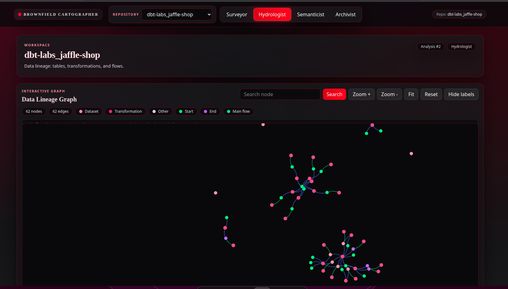
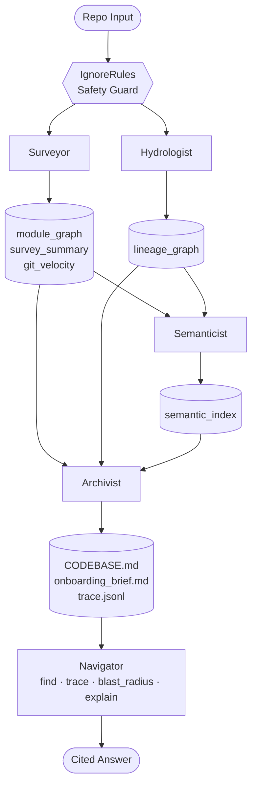

# Brownfield Cartographer

Ingest any GitHub repository (or local path) and produce a queryable knowledge graph: **module graph** (Surveyor), **data lineage graph** (Hydrologist), semantic indexing (Semanticist), and living context (Archivist). Outputs are serialized under `.cartography/`.

## Brownfield Cartography Overview

The system analyzes a codebase and builds an interactive data lineage graph—datasets, transformations, and flows—that you can search, zoom, and explore. The screenshot below shows the Hydrologist view for a typical run: nodes (datasets, transformations, start/sink) and edges (main flow) that you can query via the Navigator.



## Architecture

The pipeline is driven by a safety guard (ignore rules and file discovery), then runs Surveyor and Hydrologist in parallel-capable order; their artifacts feed the Semanticist and Archivist, which produce the living context and semantic index used by the Navigator.



**What this means:** Repository input first passes through **IgnoreRules** (safety guard) so only relevant, non-sensitive paths are analyzed. **Surveyor** produces the module graph, survey summary, and git velocity; **Hydrologist** produces the lineage graph. Both artifact sets feed **Semanticist**, which builds the semantic index (purpose statements, domains, day-one answers). **Archivist** consumes module graph, lineage, and semantic index to write the living context: `CODEBASE.md`, `onboarding_brief.md`, and the audit trace. The **Navigator** uses these artifacts to answer queries with **find** (implementation lookup), **trace** (lineage), **blast_radius** (impact), and **explain** (module summary), returning cited answers.

## Repository structure

```
src/
  cli.py                    # Entry point: takes repo path (local or GitHub URL), runs analysis
  orchestrator.py           # Wires Surveyor + Hydrologist in sequence, serializes to .cartography/
  repo_resolver.py          # Resolves local path or clones GitHub URL
  models/                   # All Pydantic schemas (Node types, Edge types, Graph types)
    module.py
    knowledge_graph.py
    lineage.py
  analyzers/
    tree_sitter_analyzer.py # Multi-language AST parsing with LanguageRouter
    sql_lineage.py          # sqlglot-based SQL dependency extraction
    dag_config_parser.py    # Airflow / dbt YAML config parsing
    python_data_flow.py     # Python data-flow (pandas, SQLAlchemy, PySpark)
    file_discovery.py
    ignore_rules.py
  agents/
    surveyor.py             # Module graph, PageRank, git velocity, dead-code candidates
    hydrologist.py          # DataLineageGraph, blast_radius, find_sources/find_sinks
  graph/
    knowledge_graph.py      # NetworkX wrapper with serialization (module graph)
    lineage_graph.py        # DataLineageGraph with serialization (lineage)
  store/                    # SQLite + optional vector store
```

## Install

**Using pip (any venv/conda):**

```bash
pip install -r requirements.txt
# or editable
pip install -e .
```

**Using uv (locked deps):**

```bash
uv sync
# or create lockfile from pyproject.toml
uv lock
uv sync
```

## Run analysis

From the repository root:

**Full analysis (Surveyor + Hydrologist)** — produces both `module_graph.json` and `lineage_graph.json` in `.cartography/`:

```bash
python -m src.cli analyze .
```

**Local path or GitHub URL:**

```bash
python -m src.cli analyze /path/to/repo
python -m src.cli analyze https://github.com/owner/repo
```

**Survey only (no lineage):**

```bash
python -m src.cli analyze . --skip-lineage
```

**Lineage only** (e.g. for an already-cloned repo):

```bash
python -m src.cli lineage .
```

**Options:**

- `--output-dir DIR` / `-o DIR` — write `.cartography/` under `DIR` (default: current directory)
- `--branch BRANCH` / `-b BRANCH` — branch to use when cloning a remote repo
- `--depth N` — clone depth (default 1); use 0 for full history
- `-v` / `--verbose` — progress logging

## Cartography artifacts

After a successful run, outputs are written under `.cartography/` (or the directory given by `--output-dir`):

| Artifact | Agent | Description |
|----------|--------|-------------|
| `module_graph.json` | Surveyor | Module graph: nodes, IMPORTS edges, PageRank, strongly connected components |
| `survey_summary.json` | Surveyor | High-impact modules, high-velocity files, risky/dead-code candidates |
| `git_velocity.json` | Surveyor | Per-file commit counts and velocity window |
| `file_hashes.json` | Surveyor | File hashes for incremental runs |
| `modules.json` | Surveyor | Enriched module list (paths, pagerank, etc.) |
| `lineage_graph.json` | Hydrologist | Data lineage: datasets, transformations, CONSUMES/PRODUCES edges |
| `sql_lineage_summary.json` | Hydrologist | Per-file SQL lineage summary (dialect, statement counts) |
| `semantic_index/` | Semanticist / Archivist | Purpose vectors (`purpose_vectors.jsonl`), `modules.json`, `domains.json`, `day_one_answers.json`, `manifest.json`, `run_meta.json` |
| `domain_architecture_map.json` | Semanticist | Module-to-domain and cluster mapping |
| `CODEBASE.md` | Archivist | Living context: architecture overview, critical path, data sources/sinks, known debt, velocity, module purpose index |
| `onboarding_brief.md` | Archivist | Day-one brief: five FDE questions with evidence citations |
| `cartography_trace.jsonl` | Archivist | Audit log of analysis actions (schema-versioned) |

## Storage (SQLite and Chroma)

Analysis results are persisted for the API, Navigator, and frontend:

- **SQLite** (`cartographer.db`, under `.cartography/` or `CARTOGRAPHER_DATA_DIR`): Stores analyses, modules, import edges, lineage nodes/edges, domain architecture, and day-one answers. Used by the API and Navigator for queries (e.g. lineage upstream/downstream, blast radius, module lookup).

- **Chroma** (`.cartography/chroma/`): Vector store for semantic search over module purpose statements. Used by the Navigator’s find-implementation and by the semantic index. Embeddings can be cached under `.cartography/embedding_cache/`.

## Tests

Run the test suite with pytest:

```bash
pytest -q
# or with uv (locked deps)
uv run pytest -q
# verbose, specific dir
pytest tests/unit/ -v
```

Key areas: `tests/unit/test_sql_lineage*.py`, `tests/unit/test_python_data_flow.py`, `tests/unit/test_hydrologist.py`, `tests/unit/test_archivist.py`, `tests/unit/test_navigator.py`, `tests/unit/test_semanticist*.py`, and `tests/unit/test_orchestrator_result.py`.
